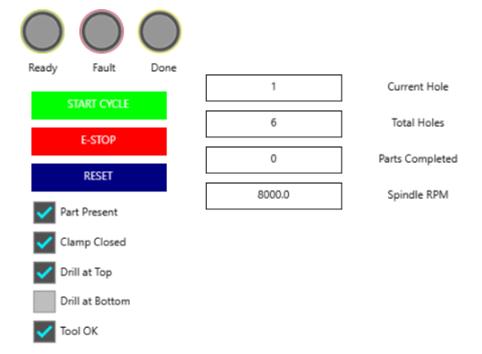
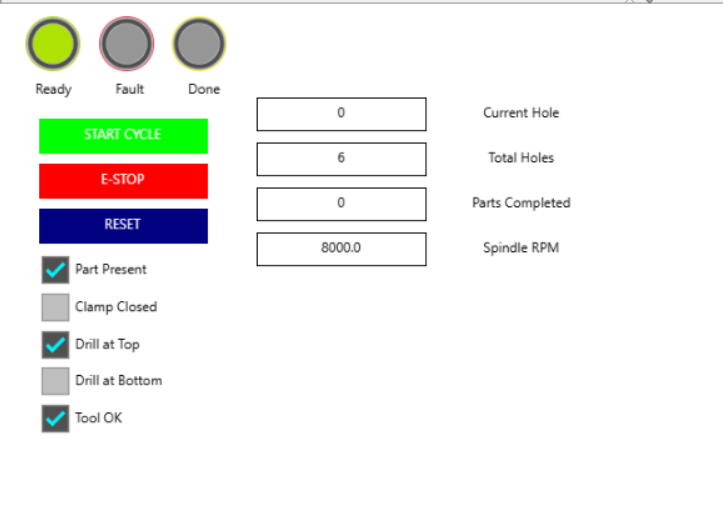
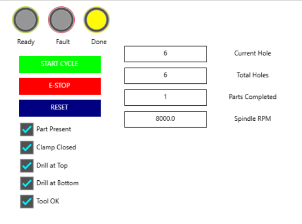
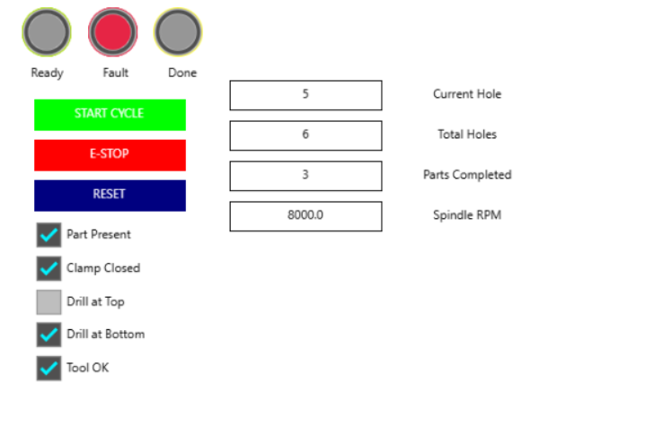
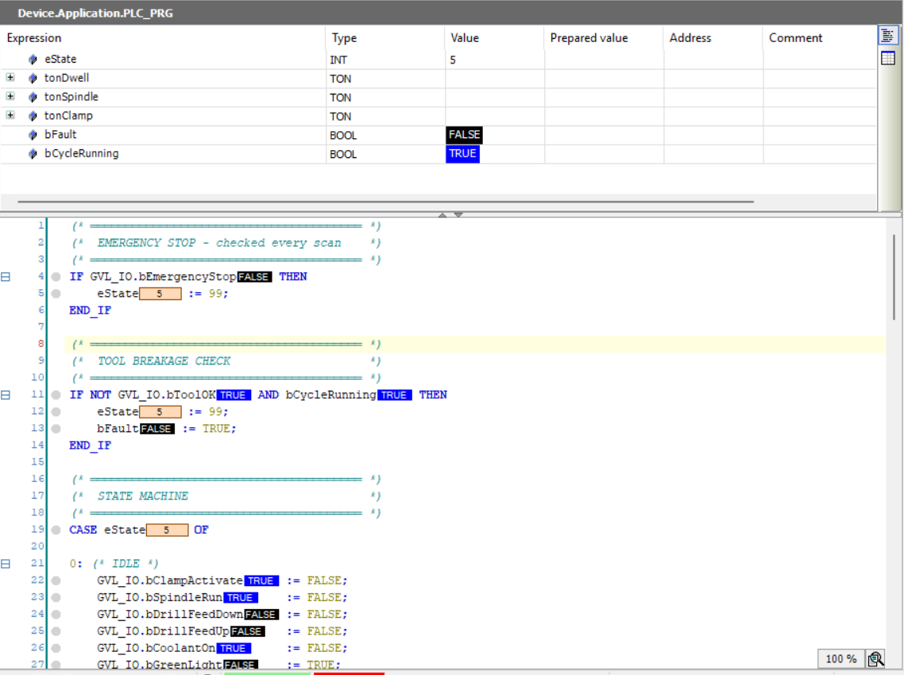
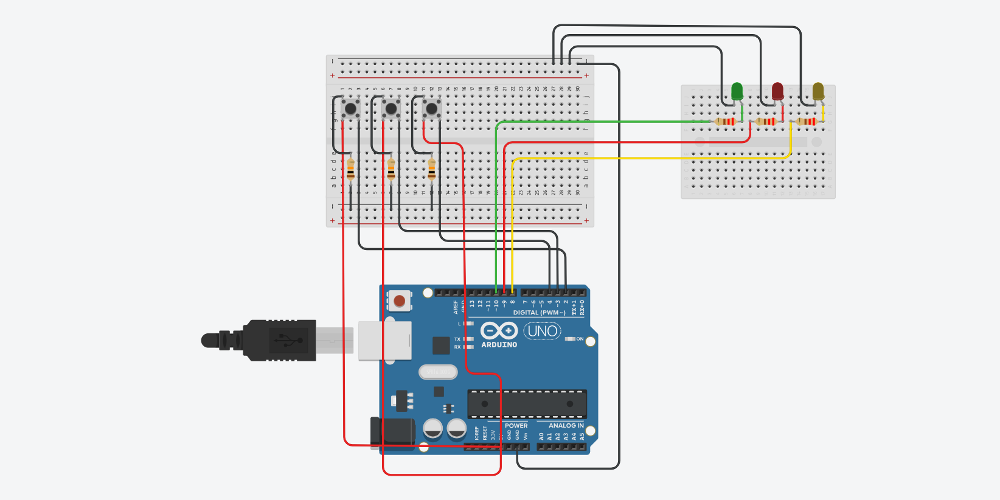

# PLC Automated Drilling Station

## Overview
PLC program (IEC 61131-3 Structured Text) controlling an
automated drilling station for aircraft panel assembly.
9-state machine with safety interlocks.

Concept for Airbus automated drilling lines.

## State Machine
| State | Name | Description |
|-------|------|-------------|
| 0 | IDLE | Waiting for start |
| 1 | CLAMP | Pneumatic clamp |
| 2 | SPINDLE | Start drill motor |
| 3 | COOLANT | Activate coolant |
| 4 | FEED DOWN | Drill descends |
| 5 | DWELL | Hold 500ms |
| 6 | RETRACT | Drill returns |
| 7 | CHECK | Next hole? |
| 8 | COMPLETE | All done |
| 99 | FAULT | E-Stop / tool break |

## Safety Features
- Emergency stop (immediate all-stop)
- Tool breakage detection
- Clamp interlock before drilling

## HMI Screenshots

### IDLE State

### Drilling State

### Complete State

### E-Stop State

### PLC Code with Live Values

## I/O Circuit

## Tools (Free)
- CODESYS V3.5 (PLC IDE + simulator)
- Tinkercad Circuits (wiring diagram)

## Author
**Oscar V. Dbritto**
M.Sc. Digitalization & Automation, PFH Stade
